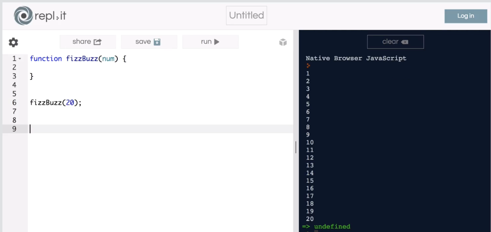
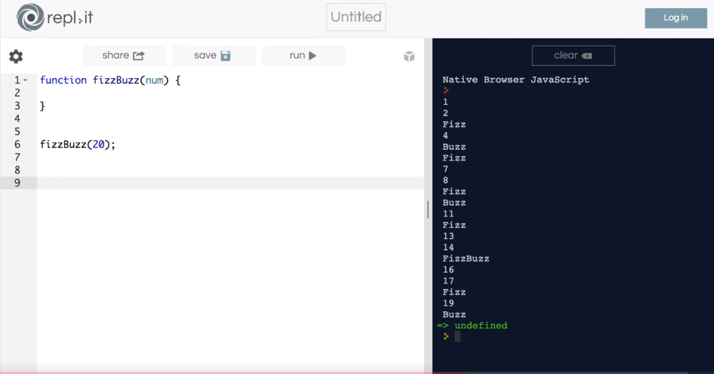

# Fizz Buzz -Intro

## Question
* a function that takes in a number as a paramter which we will call numb.
  what this function will do is it will log out the console every number from 1 to numb so if we pass the number 20 into our fizz buzz function .
  we should see the numbers 1 through 20 logged out in our console like this.

* But that is not all that our algorithm will do.  
  For each number,
  If the number divisible by 3, we want to log out the word "Fizz" instead of that number.
  If the number is divisible by 5, we want to log out the word "Buzz" instead of that number.
  If the number is divisible by 3 and 5, we want to log out the word "FizzBuzz" instead of that number.

輸入一個數字到自訂的function當參數,然後console log 從1到輸入的數字
但是若遇到參數整除3的就使用"Fizz"代替此數字,若遇到參數整除5的就使用"Buzz"代替此數字,若遇到參數既整除3又整除5的就使用"FizzBuzz"代替此數字,

## My Thinking
0. 使用迴圈從1開始,結束為輸入的數字,每次迴圈遞增1
1. 使用累計字串的方式來記錄整除3也整除5的部分
2. 判斷整除3就將"Fizz"累計到變數
3. 判斷整除5就將"Buzz"累計到變數
4. 如果累計變數長度大於0就印出,否則就印出數字

