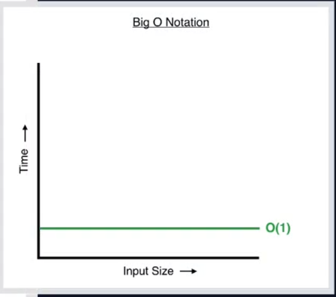
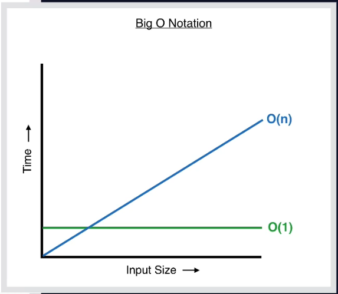
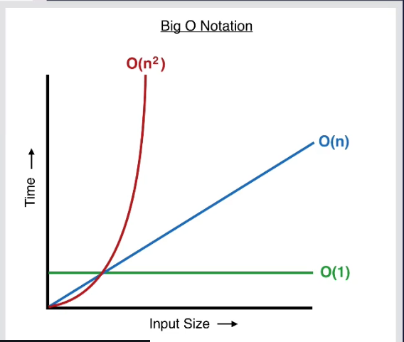
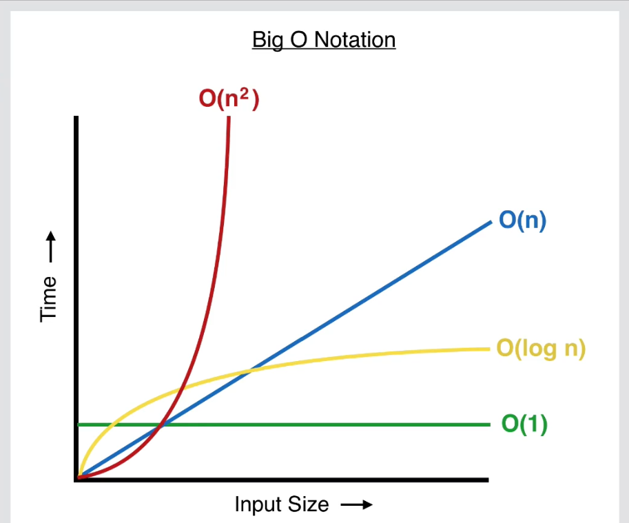

# Big O Notation 
在演算法中，常會使用 Big O Notation 和 Time Complextiy 來衡量一個演算法（函式）的好壞。通常，會根據這個函式隨著輸入的資料量增加時，執行時間會拉長多少來作為衡量的標準之一
[Big O Notation & Time Complexity](https://pjchender.blogspot.tw/2017/09/big-o-notation-time-complexity.html)

* 第一種: constant run time " O(1) "  這個演算法（函式）的執行時間不會隨著輸入資料量的增加而增加。
```javascript
    /**
     * Constant Run Time：不會隨著輸入的資料量越大而使得執行時間變長
     * Big O Notation: "O(1)"
     **/
    function log(array) {
        console.log(array[0]);
        console.log(array[1]);
    }
    log([1,2,3,4]);
    log([1,2,3,4,5,6,7,8,9,10]);

```


---

*  第二種: Linear runtime " O(n) " 當我們輸入的資料越多的時候，它就會需要等比例輸出越多的內容給我們，因此會需要消耗等比例越多的時間

```javascript { .line-numbers }
    /**
     * Linear Run Time: 隨著資料量的增加，執行時間會等比增加
     * Big O Notation: "O(n)"
     **/
    function logAll(array) {
        for(var i = 0; i < array.length; i++){
            console.log(array[i]);
        }
    }

    logAll([1,2,3,4,5]);
    logAll([1,2,3,4,5,6]);
    logAll([1,2,3,4,5,6,7]);

```



---

*  第三種: Exponential runtime " O(n^2^) " 隨著資料量的增加，執行時間會以指數成長。以下面的函式為例，當我們輸入的陣列包含 5 個元素的時候，它會輸出 25 (5^2) 筆資料；但是當我們數入的陣列包含 10 個元素的時候，它則會輸出 100 (10^2) 筆資料

```javascript
    /**
     * Exponential Run Time:  隨著資料量的增加，執行時間會誇張的增長
     * Big O Notation: "O(n^2)"
     **/
    function addAndLog(array) {
        for(var i = 0; i < array.length; i++){
            for(var j = 0; j < array.length; j++){
                console.log(array[i] + array[j]);
            }
        }
    }

    addAndLog(['A', 'B', 'C']);           // 9 pairs logged out
    addAndLog(['A', 'B', 'C', 'D']);      //16 pairs logged out
    addAndLog(['A', 'B', 'C', 'D', 'E']); //25 pairs logged out

```



---

*  第四種: Logarithimc runtime " O(log n) " 隨著資料量增加，執行時間雖然會增加，但增加率會趨緩。下面的程式碼類似 findIndex 的函式，當輸入的資料有 5 個元素時，它會先切對半後，再尋找，再切半再尋找，因此雖然隨著資料量增加，執行的時間會增加，但是當資料量越大時，執行速度增加的情況越不明顯

```javascript
    /**
     * Logarithmic Run Time: 隨著資料量增加，執行時間雖然會增加，但增加率會趨緩
     * Big O Notation: "O (log n)"
     **/
    function binarySearch(array, key) {
        
        let low = 0;
        let high = array.length - 1;
        let mid;
        let element;

        while(low <= high){
            mid = Math.floor((high + low)/2);
            element = array[mid];
            if(key > element){
                low = mid + 1;
            }else if(key < element){
                high = mid - 1;
            }else{
                return mid;
            }
        }
        return -1;
    }

    console.log(binarySearch([1,3,5,8,11,13,15,16,19,21], 3));
    console.log(binarySearch([1,3,5,8,11,13,15,16,19,21], 8));

```



---
