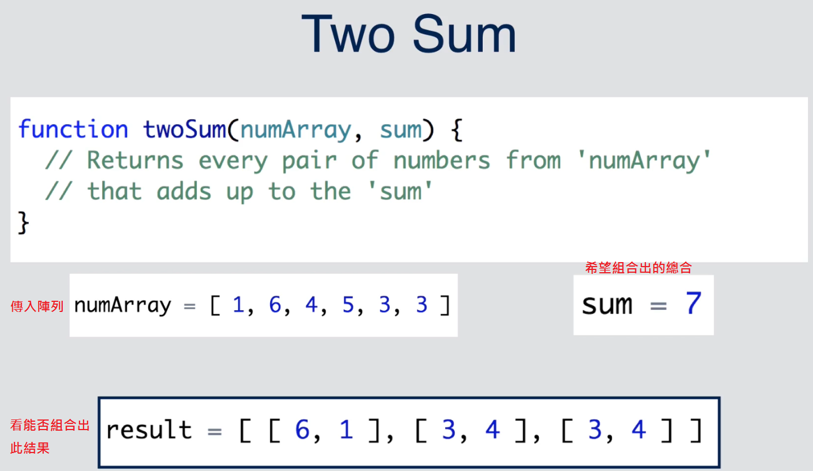

# Two Sum
[[演算法] Two Sum](https://pjchender.blogspot.tw/2017/09/two-sum.html)

## 問題描述
指定一個特定的數字，在以陣列的方式傳入許多數字（numArray），看看能否在這些數字中透過加法組合(陣列固定會有兩個數字)出這個特定的數字：
```javascript
// return every pair of numbers from 'numArray' that adds up to the 'targetSum'
function twoSum (numArray, targetSum) { ... }

twoSum([1, 6, 4, 5, 3, 3], 7)
// [[6, 1], [3, 4]]
```


條件：
輸出的結果必須是陣列中含有陣列（array of arrays），例如：[[6, 1], [3, 4]]
任何在 numArrays 中的數字是不可以被重複使用（在原課程中是可以被重複使用）

## 演算法實做
我們先建立兩個陣列，分別用來儲存配對好的結果（pairs）還有待配對的數字（waitForPair）：
```javascript
function twoSum (numArray, targetSum) {
  let pairs = [];
  let waitForPair = [];
  /* ... */
  return pairs;
}
```

接著我們透過 for...of 來疊代傳進來的陣列，將每個傳進來的數值，稱做 currNumber，而要找的數值 counterPart 就會是：
```javascript
let counterPart = targetSum - currNum;
```

如果 currNumber 在 waitForPair 找不到對應的 counterPart，就把它放入 waitForPair 中；如果可以在 waitForPair 中找到對應的 counterPart，就把它放入 pairs 中。
另外因為我們不要重複使用元素，所以要把在 waitForPair 中的數值也刪除。

寫成程式碼就像這樣：
```javascript
function twoSum (numArray, targetSum) {
  /* ... */
  for (let currNum of numArray) {
    let counterPart = targetSum - currNum
    let counterPartIndex = waitForPair.indexOf(counterPart)

    // 如果有找到相對應的 counterPart
    if (waitForPair.indexOf(counterPart) !== -1) {
      // 把這個 counterPart 從原本的陣列中移除
      waitForPair.splice(counterPartIndex, 1)
      // 把這個 counterPart 加到 pairs 中
      pairs.push([currNum, counterPart])
    } else {
      // 如果沒有找到 counterPart，則先把這個數字存到待配對中
      waitForPair.push(currNum)
    }
  }
  /* ... */
}
```