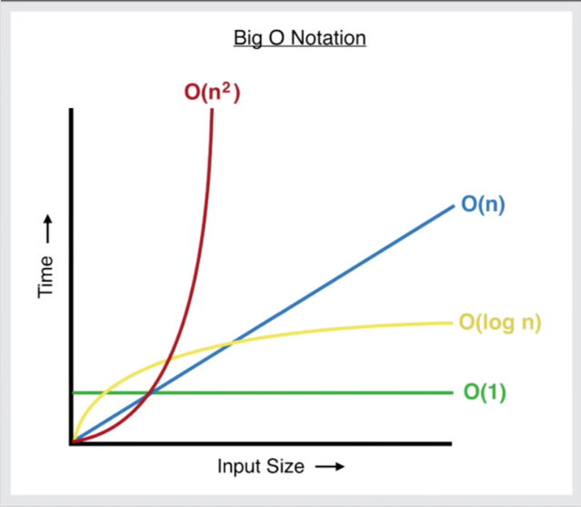

# Fibonacci
[Fibonacci：善用 cache 和 Memoization 提升程式效能](https://pjchender.blogspot.tw/2017/09/fibonacci-cache-memoization.html)

## 前置知識: 費波那契數列（Fibonacci Sequence）
費波那契數列（Fibonacci Sequence）指的是：
```
1, 1, 2, 3, 5, 8, 13, 21, 34, 55, 89, ...
```
每個數字都是前兩個數字的和，例如 1+1=2, 1+2=3, 2+3=5, 3+5=8, …，以此類推。

## 問題描述
建立一個函式 fibonacci 代入參數 position，position 表示的是想要得到 fibonacci sequence 中的第幾個數字的值。
```javascript
function fibonacci (position) {...}
fibonacci(4);    // 3
fibonacci(9);    // 34
```

## 使用遞回函式
這裡一樣可以透過遞回函式來處理，我們先觀察一下 Fibonacci Sequence：
```javascript
fibonacci(1);   // 1
fibonacci(2);   // 1
fibonacci(3);   // 2 fibonacci(2) + fibonacci(1)
fibonacci(4);   // 3 fibonacci(3) + fibonacci(2)
fibonacci(5);   // 5 fibonacci(4) + fibonacci(3)
fibonacci(6);   // 8 fibonacci(5) + fibonacci(4)
```
從上面我們可以發現，除了 position 為 1 和 position 為 2 的情況之外，其他的都是前兩個相加，也就是：
```
fibonacci (position) === fibonacci (position - 1) + fibonacci (position - 2);
```

## 初步解法
因此利用遞回函式的概念，可以寫出：
```javascript
function fibonacci (position) {
  if (position <= 2) {
    // position === 1 || position === 2
    return 1
  } else {
    return fibonacci(position - 1) + fibonacci(position - 2)
  }
}

fibonacci(6)   // 5, fibonacci(4) + fibonacci(3)
```

## Time Complexity
然而，利用這種初步的遞回函式的演算法是屬於 O(n^2)，也就是說當 position 輸入的數值越大時，運算的時間會呈指數（爆炸性的）成長：
```
fibonacci(3) ，需要執行 3 次該函式 
fibonacci(5) ，需要執行 9 次該函式 
fibonacci(7) ，需要執行 25 次該函式 
fibonacci(10) ，需要執行 109 次該函式 
fibonacci(20) ，需要執行 13259 次該函式 
fibonacci(30) ，需要執行 1664079 次該函式
```
因此，可以看得出來單純透過遞回函式並不是解決 Fibonacci Sequence 非常好的演算法。


## 進階解法：Memoized Fibonacci
在第二的方法中，我們使用到的是 Memoization(Tabulation)，搭配遞回函式：
* 檢驗數字是否已經存在 cache 當中
* 如果這個數字已經在 cache 中，則使用這個數字
* 如果這個數字不在 cache 中，把它算出來後放在 cache 中，因此可以在未來被使用
```javascript
// cache: an array used as memory
function fibMemo (index, chache) {...}
```

### 程式碼
```javascript
function fibMemo (position, cache = []) {
  if (cache[position]) {
    // 如果在 cache 中有找到該 position 的數值，則直接回傳不用重算
    return cache[position]
  } else {
    // 如果在 cache 中沒有找到該 position 的數值，則計算該 position 的數值，並存到 chache 中
    if (position <= 2) {
      cache[position] = 1
    } else {
      cache[position] = fibMemo(position - 1, cache) + fibMemo(position - 2, cache)
    }
    return cache[position]
  }
}
```

### Time Complexity
利用這種函式的演算法是屬於 O(n)，也就是說當 position 輸入的數值越大時，運算的時間會只會以線性成長：
```
fibMemo (3) ，需要執行 3 次該函式 
fibMemo (5) ，需要執行 10 次該函式 
fibMemo (7) ，需要執行 21 次該函式 
fibMemo (10) ，需要執行 38 次該函式 
fibMemo (20) ，需要執行 75 次該函式 
fibMemo (30) ，需要執行 132 次該函式
```
因此我們可以看出，使用 Memoization 的技巧，將計算好的值存到 cache 裡面，是比較好的演算法。


## 完整程式碼
```javascript
/**
 * Fibonacci through recusive function
 * O(n^2) which is not a good algorithm
**/
function fibonacci (position) {
  counter++
  if (position <= 2) {
    // position === 1 || position === 2
    return 1
  } else {
    return fibonacci(position - 1) + fibonacci(position - 2)
  }
}
fibonacci(20)

/**
 * Memorized Finonacci: save the computed result in cache and reuse it
**/
function fibMemo (position, cache = []) {
  if (cache[position]) {
    /**
     * 如果在 cache 中有找到該 position 的數值，
     * 則直接回傳不用重算
    **/
    return cache[position]

  } else {
    /**
     * 如果在 cache 中沒有找到該 position 的數值，
     * 則計算該 position 的數值，並存到 cache 中
    **/
    if (position <= 2) {
      cache[position] = 1
    } else {
      cache[position] = fibMemo(position-1, cache) + fibMemo(position-2, cache)
    }

    return cache[position]
  }
}

fibMemo(20)
```


