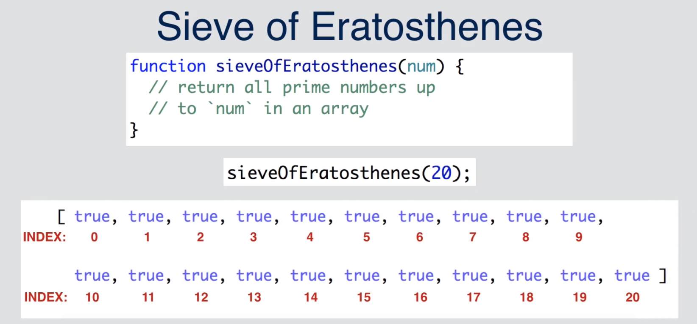
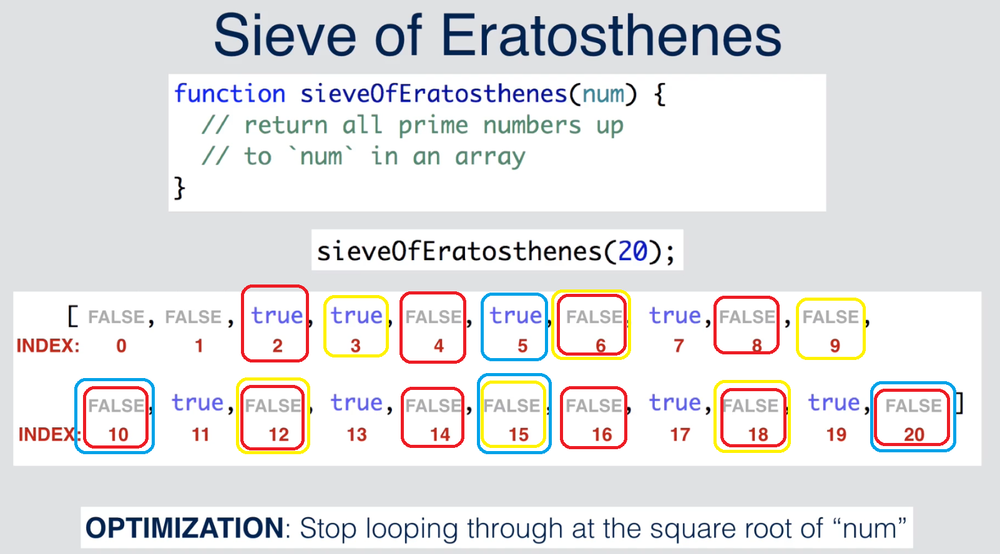

# Sieve of Eratonstheness
[[演算法] Algorithm: Sieve of Eratosthenes 質數判斷](https://pjchender.blogspot.tw/2017/09/algorithm-sieve-of-eratosthenes.html)

## 問題描述
給予一個數值，把所有小於此數值的質數（Prime）都列出來：
```javascript
// 以陣列的方式列出小於 number 的所有質數
function sieveOfEratosthenes (number) {...}
sieveOfEratosthenes(20) // [2, 3, 5, 7, 11, 13, 17, 19]
```

## 前置知識
* 質數與合數
  數字可以分成質數（Prime）和合數（Composite），而質數的定義是：「一個大於 1 的整數，除了 1 和數本身以外，沒有其他的因數」，質數之外的都屬於合數。
  ```
  2 = 1 * 2        // 2 是質數
  3 = 1 * 2        // 3 是質數
  4 = 1 * 4        // 4 是合數
    = 2 * 2

  5 = 1 * 5        // 5 是質數
  6 = 1 * 6        // 6 是合數
  6 = 2 * 3        // 6
  ```
  **判斷 N 以內的數是否為質數，只需判斷到 √N 之前有無除了 1 的質因數即可**
  在判斷一個數字是否為質數前，只需判斷該數目 n 的 1 ~ √n 中有無因數即可，這是什麼意思呢？
  假設要判斷 4 以內的所有質數，只需判斷 1 ~ √4 之間有沒有除了 1 的質因數就好。也就是只要判斷 1 ~ 2 有沒有除了 1 是 4 的質因數：
  ```
  4 = 1 * 4
    = 2 * 2
  ```
  假設要判斷 25 以內的質數，只需要判斷 1 ~ √25 之間有沒有除了 1 的質因數就好。也就是只要判斷 1 ~ 5 有沒有除了 1 是 25 的質因數：
  ```
  25 = 1 * 25
     = 5 * 5
  ```
  簡單來說：
  > 假如一個數 N 是合數，它有一個因數 a, a × b = N 
    則 a、b 兩個數中必有一個大於或等於 √N，一個小於或等於 √N。 
    因此，只要小於或等於 √N 的數中（1除外）不能整除 N，則 N 一定是質數。 
    [判斷質數合數的「開根號法」的數學原理？怎麼推導的？ @ 百度](https://zhidao.baidu.com/question/50140553.html)

## 演算法實做
實做這個演算法的邏輯大致如下，如果我們要取小於 20 以下的質數，那麼我就先建立一個長度為 21 （index 為 0 ~ 20）的陣列，每個元素都代入 **true**，例如：
```javascript
// 若為 `true` 表示它是質數；`false` 則不是質數
let isPrimeArr = [true, true, true, true, true, true, ...]
```



然後我們由 index 0 開始一個一個判斷，如果它不是質數，則將它改成 false。
* 0, 1 不是質數
* 2 是質數，把所有 2 的倍數都改成 false
* 3 是質數，把所有 3 的倍數都改成 false
* 5 是質數，把所有 5 的倍數都改成 false
* 繼續以此類推

#### 建立一個全都是相同元素的陣列
我們可以用 new Array(length) 來建立一個特定長度的陣列，接著搭配 Array.prototype.fill('<element>') 來把裡面的值都代為 true：
```javascript
// 建立一個陣列包含 number + 1 個元素，且元素值均為 true
let isPrimeArr = new Array(n + 1).fill(true)
```

#### 0 和 1 不是質數
接著，因為我們知道 0 和 1 不是質數，所以：
```javascript
// 因為我們知道 0 和 1 不是質數
isPrimeArr[0] = false
isPrimeArr[1] = false
```

#### 判斷是否為合數
再來我們要逐字判斷式否為 n 的倍數，是的話表示它是合數：
```javascript
// 我們只需判斷到 √n 即可
for (var i = 2; i <= Math.sqrt(n); i++) {
  // 如果 isPrimeArr[i] 是質數，把所有該倍數都標為非質數
  if (isPrimeArr[i] === true) {
    for (var j = 2; i * j <= n; j++) {
      isPrimeArr[i * j] = false;
    }
  }
}
```

假設我們的 n 是 10 的話，這段迴圈會輸出的結果大概像這樣：
```
2 的倍數: 4
2 的倍數: 6
2 的倍數: 8
2 的倍數: 10
3 的倍數: 6
3 的倍數: 9
```
這些倍數都會被標住為 false


#### 把 true 改成 index，把 false 過濾掉
最後可以透過 Array.prototype.map 將 isPrimeArr 中為 true 的內容，代成 index 的值，這時候的陣列會長的像：
```javascript
isPrimeArr = isPrimeArr.map((item, index) => {
  return item ? index : false
})
// [ false, false, 2, 3, false, 5, false, 7, false, false, false ]
```
接著再透過 Array.prototype.filter 將所有元素為 false 的結果過濾掉
```javascript
// Array.prototype.filter 會把回傳為 true 的陣列元素留下；回傳為 false 的陣列素過濾掉
isPrimeArr = isPrimeArr.filter(item => item)
// [ 2, 3, 5, 7 ]
```

## 完整程式碼
```javascript
function sieveOfEratosthenes (n) {
  // 建立一個陣列包含 number + 1 個元素，且元素值均為 true
  let isPrimeArr = new Array(n + 1).fill(true)
  
  // 因為我們知道 0 和 1 不是質數
  isPrimeArr[0] = false
  isPrimeArr[1] = false
  
  // 我們只需判斷到 √n 即可
  for (var i = 2; i <= Math.sqrt(n); i++) {
    // 如果 isPrimeArr[i] 是質數，把所有該倍數都標為非質數
    if (isPrimeArr[i] === true) {
      for (var j = 2; i * j <= n; j++) {
        console.log(`${i} 的倍數: ${i * j}`)
        isPrimeArr[i * j] = false;
      }
    }
  }
  
  /**
   * 透過 arr.map 將 isPrimeArr 中為 true 的內容，代成 index 的值
   * 透過 arr.filter 將陣列中的 false 都過濾掉
  **/
  
  console.log()
  return isPrimeArr.map((item, index) => {
    return item ? index : false
  }).filter(item => item)
}


console.log(sieveOfEratosthenes(100)) 
/*
[ 2, 3, 5, 7, 11, 13, 17, 19, 23, 29, 31, 37, 41, 43,
47, 53, 59, 61, 67, 71, 73, 79, 83, 89, 97 ]
*/
```
