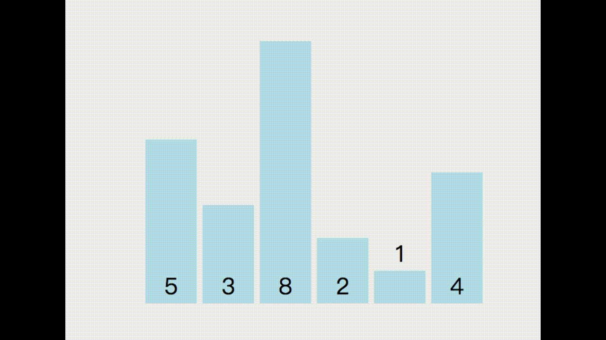

# Bubble Sort
[[演算法] 氣泡排序法（Bubble Sort）：利用兩兩元素交換位置達到排序](https://pjchender.blogspot.tw/2017/09/bubble-sort.html)

## 問題描述
以陣列的方式傳入許多數值，回傳排序好的資料：
```javascript
function bubbleSort (arr) {...}
```

Bubble Sort 的方式是從陣列的最前面開始，一次比較陣列中兩兩相鄰的元素，然後根據大小將它們調換順序，大的移到後面：
1. 當我們比較過所有元素一次後，可以確保數值最大的元素在最後面
2. 接著扣掉陣列中的最後一個元素（因為已經確定它是最大的），接著重複上面的步驟進行兩兩比較
3. 重複上述動作，直到排序完畢。假設這個陣列有 6 個元素一共需重複這個動作 5 次（Array.length - 1）才能確保排序完畢。


## 演算法實做
假設我們一開始的陣列是 [5, 3, 8, 2, 1, 4]，我們每次跑完迴圈的結果會依序像這樣子：
```
// 一開始：[5, 3, 8, 2, 1, 4]

// 第一次排序，每個都要排到（index: 0 ~ 5），排完確定最後一個數值（8）是最大的
[ 3, 5, 2, 1, 4, 8 ]

// 第二次排序，只需排到倒數第二個（index: 0 ~ 4），排完確定倒數第二個數值（5）是最大的
[ 3, 2, 1, 4, 5, 8 ]

// 第三次排序，只需排到倒數第三個（index: 0 ~ 3），排完確定倒數第三個數值（4）是最大的
[ 2, 1, 3, 4, 5, 8 ]

// 第四次排序，只需排到倒數第四個（index: 0 ~ 2），排完確定倒數第四個數值（3）是最大的
[ 2, 1, 3, 4, 5, 8 ]

// 第五次排序，只需排到倒數第四個（index: 0 ~ 1），排完確定倒數第五個數值（2）是最大的
[ 1, 2, 3, 4, 5, 8 ]
```

我們可以觀察到，對於元素數目為 6 的陣列，第一次排序需要從 index 0 ~ 5，第二次 0 ~ 4，第三次 0 ~ 3，第四次 0 ~ 2，第五次 0 ~ 1，以此類推，因此我們可以定義一個變數叫 toIndex，使用 while 迴圈，讓它每跑一次迴圈 toIndex 就減 1：
```javascript
function bubbleSort (arr) {
  let toIndex = arr.length;
  
  while (toIndex > 1) {
    toIndex--;
   // ...
  }
  return arr;
}
```

接著我們要來寫讓陣列內的元素重新排序的方法，這裡會用到我們在之前Reverse Array in Place 的方法，透過暫存變數的建立來幫助我們交換元素值：
```javascript
// 如果前面的元素比後面的元素大，則交換元素位置
for (let i = 0; i < toIndex; i++) {
  if (arr[i] > arr[i+1]) {
    let tempValue = arr[i];
    arr[i] = arr[i + 1];
    arr[i + 1] = tempValue;
  }
}
```
統整起來後，完整的程式碼如下段所示。

## 完整程式碼
```javascript
function bubbleSort (arr) {
  let toIndex = arr.length
  
  while (toIndex > 1) {
    toIndex--
    for (let i = 0; i < toIndex; i++) {
      // 如果前面的元素比後面的元素要大，則交換元素位置
      if (arr[i] > arr[i + 1]) {
        let tempValue = arr[i]
        arr[i] = arr[i + 1]
        arr[i + 1] = tempValue
      }
    }
  }
  return arr
}

console.log(bubbleSort([5, 3, 8, 2, 1, 4]))
// console.log(bubbleSort([20, 20, 31, 56, 1, 12, 12]))
// console.log(bubbleSort([3, -9, -12, -1, 8]))
```