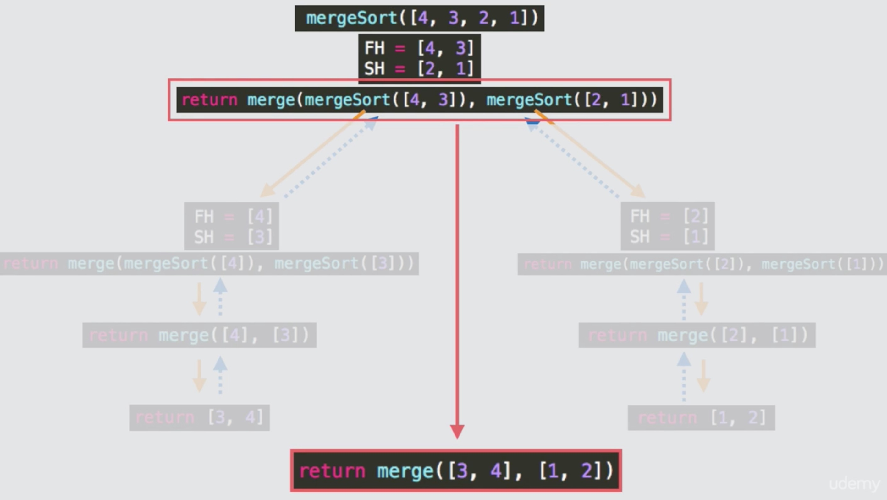

# Merge Sort
[[演算法] 合併排序法（Merge Sort）](https://pjchender.blogspot.tw/2017/09/merge-sort.html)

[影音說明1:合併陣列演示](img/mergeSort-1.mp4)
[影音說明2](img/mergeSort-2.mp4)
[影音說明3:mergeSort演算範例演示](img/mergeSort-3.mp4)

## 問題描述
透過函式將陣列中的數值加以排序。

## 前置知識：Merge Sort
Merge Sort 和 Bubble Sort 一樣，都是一種用來排序的演算法。
Merge Sort 的演算法主要包含兩個部分：
 1. 將陣列對半拆分
 Merge Sort 的第一步是要將陣列兩兩對半拆分，直到拆到每個陣列只剩一個元素：
 ```
    // 原本的陣列
    [3, 20, 8, 5, 1, 12, 17, 2]
    // 進行對半拆分
    [3, 20, 8, 5], [1, 12, 17, 2]
    // 再拆分
    [3, 20], [8, 5], [1, 12], [17, 2]
    // 再拆分
    [3], [20], [8], [5], [1], [12], [17], [2]
 ```

 2. 將陣列排序後加以合併
 我們把上面拆分好的陣列，兩兩一組開始進行排序，每次排序時都是取該陣列的第一個元素進行比較：
 ```
    // 拆分好的陣列
    [3], [20], [8], [5], [1], [12], [17], [2]

    // [3] vs [20]; [8] vs [5]; [1] vs [12]; [17] vs [2]
    // 兩兩比較排序後合併，每次比較都是取當時陣列中的第一個元素進行比較
    [3, 20], [5, 8], [1, 12], [2, 17]

    // 再一次兩兩比較後排序後合併，每次比較都是取當時陣列中的第一個元素進行比較
    [3, 5, 8, 20], [1, 2, 12, 17]

    // 再一次兩兩比較後排序後合併，每次比較都是取當時陣列中的第一個元素進行比較
    [ 1, 2, 3, 5, 8, 12, 17, 20 ]
 ```
 兩兩比較後排序的方式可以參考下圖，每次比較都是取各陣列的第一個元素來進行比較：
 

 整個合併排序法如下圖所示：
 

因此我們一共需要兩個函式，並且一樣會透過遞回函式的方式來處理：
```javascript
function mergeSort (arr) {
  // 接受一組尚未排序的陣列當作參數，將它們對半切分  
}

function sortBeforeMerge (arr1, arr2) {
  /**
   * 代入兩個已經各自排序過的陣列
   * 每次都取這兩個陣列中當時的第一個元素進行比較
   * 把數值小的放前面，最後合併成一個陣列
   **/
}
```
Merge Sort 這個演算法我覺得稍微有一點點小小複雜，非常需要圖像化來幫助思考，但我們可以先看 code ，看完之後會更瞭解它實際上的運作方式。

## 演算法實做
1. **將陣列進行對半切分**
```javascript
function mergeSort (arr) {
  // 接受一組尚未排序的陣列當作參數，將它們對半切分
  let middleIndex = Math.floor(arr.length / 2)
  let firstHalf = arr.slice(0, middleIndex)
  let secondHalf = arr.slice(middleIndex)  
}
```

2. **將兩組各自已經排序過的陣列以 merge sort 的方式合併**
首先透過 while 迴圈，當傳入的兩組 已經各自排序過的 的陣列 arr1 和 arr2 都沒有空陣列的情況下，選出兩陣列中當時的第一個元速進行比較，把比較小的先放入 sortedArr 中：
```javascript
function sortBeforeMerge (arr1, arr2) {
  let sortedArr = []
  
  // 當 arr1 或 arr2 都不是空陣列時
  while (arr1.length && arr2.length) {
    // 以兩陣列中第一個元素進行比較，較小的推入 sortedArr 中
    let minElement = (arr1[0] < arr2[0]) ? arr1.shift() : arr2.shift()
    sortedArr.push(minElement)
  }
}
```
經過 while 迴圈後，我們會得到一組已經經過 merge sort 方式排序好的陣列；另外，while 迴圈終止的條件是只要 arr1 或 arr2 其中一組為空陣列時就會停止，因此這時候 arr1 或 arr2 其中有一組還不是空陣列，我們要把不為空陣列的陣列透過 Array.prototype.concat 連接到 sortedArr 後面。

由於我們傳進 sortBeforeMerge 這個函式的陣列是已經經過排序的，因此，可以確定透過 concat 連結好的陣列，其數值也會是由小到大的：
```javascript
function sortBeforeMerge (arr1, arr2) {
  let sortedArr = []
  
  // 當 arr1 或 arr2 都不是空陣列時
  while (arr1.length && arr2.length) {
    // ...
  }
  
  /**
   * 會跳出上面 while 的迴圈，表示 arr1 或 arr2 其中至少有一個為空陣列
   * 因此，如果 arr1 不是空陣列，則把它 concat 到 sortedArr 內；
   * 如果是 arr2 中不是空陣列，則把它 concat 到 sortedArr 內。
  **/
  sortedArr = arr1.length ? sortedArr.concat(arr1) : sortedArr.concat(arr2)
  return sortedArr
}
```

3. **結合遞回函式**
最後我們要把 mergeSort 這個函式結合遞回的概念，在使用遞回函式時，一定要記得設定終止條件：
```javascript
function mergeSort (arr) {
  
  // 遞回函式終止條件：當陣列被拆到只剩一個元素時
  if (arr.length <= 1) {
    return arr
  }
  
  // 接受一組尚未排序的陣列當作參數，將它們對半切分
  // ...
  
  // 遞回函式
  return sortBeforeMerge(mergeSort(firstHalf), mergeSort(secondHalf))
}
```

### 完整程式碼
```javascript
function mergeSort (arr) {
  
  // 遞回函式終止條件：當陣列被拆到只剩一個元素時
  if (arr.length <= 1) {
    return arr
  }
  
  // 接受一組尚未排序的陣列當作參數，將它們對半切分
  let middleIndex = Math.floor(arr.length / 2)
  let firstHalf = arr.slice(0, middleIndex)
  let secondHalf = arr.slice(middleIndex)
  
  // 遞回
  return sortBeforeMerge(mergeSort(firstHalf), mergeSort(secondHalf))
}

function sortBeforeMerge (arr1, arr2) {
  /**
   * 代入兩個已經"各自排序過"的陣列，
   * 將這兩個陣列利用 merge sort 的方式排序後，合併回傳成一個陣列
   **/
  let sortedArr = []
  
  // 當 arr1 或 arr2 都不是空陣列時
  while (arr1.length && arr2.length) {
    // 以兩陣列中第一個元素進行比較，較小的推入 sortedArr 中
    let minElement = (arr1[0] < arr2[0]) ? arr1.shift() : arr2.shift()
    sortedArr.push(minElement)
  }
  
  /**
   * 會跳出上面 while 的迴圈，表示 arr1 或 arr2 其中至少有一個為空陣列
   * 因此，如果 arr1 不是空陣列，則把它 concat 到 sortedArr 內；
   * 如果是 arr2 中不是空陣列，則把它 concat 到 sortedArr 內。
  **/
  sortedArr = arr1.length ? sortedArr.concat(arr1) : sortedArr.concat(arr2)
  return sortedArr
}

console.log(mergeSort([3, 20, 8, 5, 1, 12, 17, 2]))
```

## 圖像化思考
上面這個情況可能會有點難想像實際上的遞回是怎麼執行的，假設我們現在執行函式：
```
mergeSort([4, 3, 2, 1])
```

它實際上會先將陣列拆成 [4, 3] 和 [2, 1]，接著
```
return sortBeforeMerge(mergeSort[4, 3], mergeSort[2, 1])
```

這時候遞回函式就需要先去計算出 mergeSort[4, 3] 和 mergeSort[2, 1] 的值。
以 mergeSort[4, 3] 為例，它則是會先把陣列拆成 [4], [3]，接著 return sortBeforeMerge([4], [3]) ，在經過 sortBeforeMerge 的函式時，它會取這兩個陣列當時的第一個元素比較大小，最後會回傳 [3, 4]。
同理， mergeSort[2, 1] 在經過 sortBeforeMerge([2], [1]) 之後，會回傳 [1, 2]。
如下圖所示：
 

因此一開始的：
```
return sortBeforeMerge(mergeSort[4, 3], mergeSort[2, 1])
```
便會變成：
```
return sortBeforeMerge([3, 4], [1, 2])
```

最後便會得到 [1, 2, 3, 4]。


如下圖所示：
 